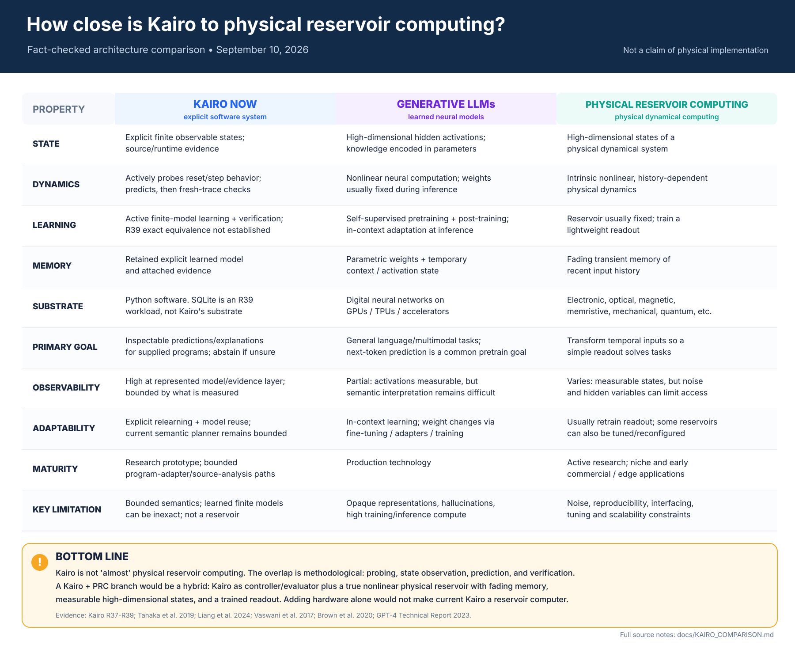

# Kairo vs. LLMs vs. Physical Reservoir Computing

**Fact-checked snapshot: 2026-09-10**

This comparison is meant to prevent an architectural analogy from turning into a stronger claim than the evidence supports. Kairo currently overlaps with reservoir computing mainly at the level of *probing, state observation, prediction, and verification*. It is **not** a physical reservoir computer, and converting it into one would require a new physical dynamical compute path rather than simply swapping Python for hardware.

| Property | Kairo now | Typical generative LLMs | Physical reservoir computing |
|---|---|---|---|
| **State** | Explicit finite observable states learned from bounded program behavior, plus source/runtime evidence. | High-dimensional hidden activations conditioned on tokens/context; persistent learned knowledge is encoded in parameters. | High-dimensional states of a physical dynamical system. |
| **Dynamics** | Actively queries a reset/step boundary, learns finite observable behavior, predicts, then checks against fresh execution. | Input-dependent nonlinear neural computation; parameters are normally fixed during inference while activations and context evolve. | Intrinsic nonlinear, history-dependent physical dynamics transform incoming signals. |
| **Training / learning** | Active model learning with fresh-trace verification and equivalence-style checks where available. R39 did **not** establish exact finite-model equivalence for its SQLite policies. | Large-scale self-supervised pretraining, commonly next-token prediction for autoregressive models, followed by post-training/fine-tuning. In-context adaptation can occur without weight updates. | The reservoir is commonly left fixed while a lightweight readout, often linear or ridge-regression based, is trained. |
| **Memory** | Retained explicit learned model and attached evidence; persistence depends on the current implementation/workload. | Parametric memory in weights plus temporary context/activation state; systems may also use external memory/tools. | Fading/transient memory of recent input history is a characteristic reservoir property. |
| **Substrate** | Software implemented in Python. SQLite is a transaction workload exercised in R39, **not Kairo's computing substrate**. | Digital neural networks executed on GPUs, TPUs, or other accelerators. | Physical dynamics in electronic, optical, magnetic, memristive, mechanical, soft/robotic, quantum, or other suitable systems. |
| **Primary goal** | Build inspectable predictions/explanations for supplied programs and abstain when evidence is insufficient. | General language/multimodal task performance; next-token prediction is a common pretraining objective for autoregressive LLMs, not the complete deployed-system goal. | Map temporal inputs through rich dynamics so a simple readout can solve downstream tasks. |
| **Observability** | High at the represented model/evidence layer, but only for the bounded states and evidence Kairo actually measures. | Partial: internal activations are measurable, but reliable semantic interpretation remains difficult. | Varies by implementation: physical states can be measured, but dimensionality, noise, and hidden variables can limit observability. |
| **Adaptability** | Explicit relearning/model reuse across questions; the current semantic planner is still bounded. | In-context learning can change behavior without changing weights; weight-level adaptation uses fine-tuning, adapters, or additional training. | Usually adapt the readout; some reservoirs can also be physically tuned or reconfigured. |
| **Maturity** | Research prototype with bounded program-adapter and source-analysis paths. | Production technology. | Active research with niche and early commercial/edge applications. |
| **Key advantage** | Inspectable evidence, explicit state modeling, fresh-trace verification, and abstention. | Broad prior knowledge plus flexible language and multimodal interfaces. | Potentially fast, low-training-cost, and energy-efficient temporal processing, depending on the substrate. |
| **Key limitation** | Bounded semantics/program interface; learned finite observable models can be inexact; not a reservoir. | Opaque internal representations, hallucinations, and substantial training/inference compute. | Hardware noise, reproducibility, measurement/interfacing, tuning, scalability, and task-flexibility constraints. |

## Bottom line

Kairo is **not “almost” physical reservoir computing**. The strongest defensible connection is methodological: Kairo learns and checks observable behavior of a system, while reservoir computing exploits the state trajectory of a nonlinear dynamical system. Those ideas can complement each other, but they are not the same architecture.

A **Kairo + physical reservoir** research branch would keep Kairo as the experiment controller, model/evidence layer, and evaluator, while adding a genuine reservoir that provides:

1. a nonlinear physical dynamical substrate,
2. high-dimensional measurable states,
3. fading memory / temporal response,
4. a trained task readout, and
5. repeatable input/output interfaces so Kairo can probe and verify the reservoir experimentally.

That would be a hybrid architecture, not merely a hardware port of current Kairo.

## Evidence from this repository

- [`R37_REPORT.md`](../R37_REPORT.md): Kairo learns finite observable behavior once, predicts a bounded action plan, runs the same plan against a fresh program process, and returns an answer only when prediction and fresh trace agree.
- [`R38_REPORT.md`](../R38_REPORT.md): source-backed purpose/function/text questions are explicitly separated from runtime-behavior claims.
- [`R39_REPORT.md`](../R39_REPORT.md): SQLite transaction experiments showed retained-model query reduction, but all tested policies had counterexamples in the exact finite projected-state equivalence check.
- [`README.md`](../README.md): describes Kairo as an experimental local system for questions about a supplied program path, with inspectable evidence and abstention when evidence is insufficient.

## External references

- Tanaka, G. et al. (2019), **Recent advances in physical reservoir computing: A review**, *Neural Networks* 115, 100-123. https://doi.org/10.1016/j.neunet.2019.03.005
- Liang, X. et al. (2024), **Physical reservoir computing with emerging electronics**, *Nature Electronics* 7, 193-206. https://doi.org/10.1038/s41928-024-01133-z
- Vaswani, A. et al. (2017), **Attention Is All You Need**. https://arxiv.org/abs/1706.03762
- Brown, T. B. et al. (2020), **Language Models are Few-Shot Learners**. https://arxiv.org/abs/2005.14165
- OpenAI (2023), **GPT-4 Technical Report**. https://arxiv.org/abs/2303.08774

## Claim discipline

This document is an architecture comparison, not a novelty claim, benchmark claim, or assertion that Kairo currently implements reservoir computing. Where a row summarizes a broad research field, wording is intentionally qualified because implementations vary.
